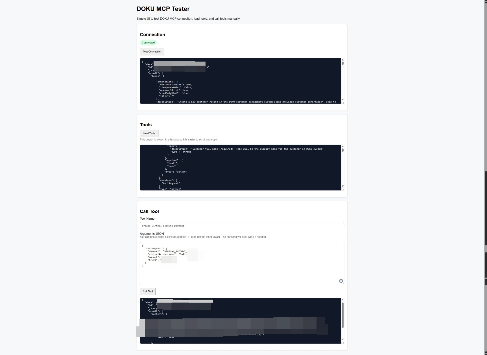
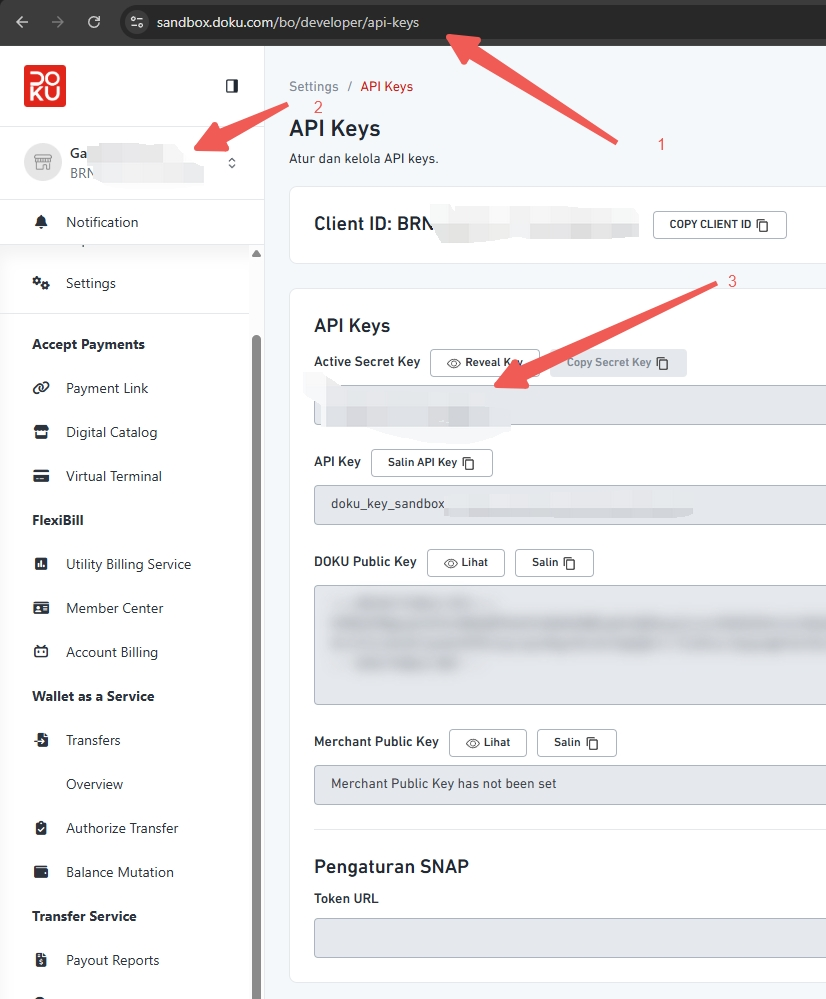

# DOKU MCP Tester v2

A lightweight Flask web app to test and explore [DOKU MCP Server](https://api-sandbox.doku.com) endpoints via a simple browser UI.

## Features

- 🔌 **Test Connection** — Verify MCP server connectivity
- 🛠️ **Load Tools** — List all available tools from the MCP server
- 📬 **Call Tool** — Manually invoke any tool with custom JSON arguments
- Auto-wraps `toolRequest` if not present in arguments
- Clean, scrollable output with dark theme textarea

## Preview

### App UI


### Where to Find Your Credentials
Get your **Client ID** and **API Key** from the DOKU Sandbox dashboard:



> Go to `sandbox.doku.com/bo/developer/api-keys`:
> 1. Copy the URL from your browser address bar
> 2. Find your **Client ID** (top of the page)
> 3. Click **Reveal Key** to get your **Active Secret Key**

## Setup

### 1. Clone the repo
```bash
git clone https://github.com/galeka/doku-mcp-tester.git
cd doku-mcp-tester
```

### 2. Configure credentials
```bash
cp config.example.json config.json
```

Edit `config.json` and fill in your DOKU credentials:
```json
{
  "app": {
    "host": "127.0.0.1",
    "port": 5000,
    "debug": true
  },
  "doku": {
    "mcp_url": "https://api-sandbox.doku.com/doku-mcp-server/mcp",
    "client_id": "YOUR_CLIENT_ID",
    "api_key": "YOUR_API_KEY"
  }
}
```

> ⚠️ `config.json` is listed in `.gitignore` and will **never** be committed to the repo.

### 3. Run the app

**Mac / Linux:**
```bash
chmod +x run.sh && ./run.sh
```

**Windows:**
```bat
run.bat
```

Then open your browser at: [http://127.0.0.1:5000](http://127.0.0.1:5000)

## Project Structure

```
doku-mcp-tester/
├── app.py                # Flask backend
├── templates/
│   └── index.html        # Frontend UI
├── docs/
│   ├── screenshot-app.png
│   └── screenshot-api-keys.jpg
├── config.example.json   # Config template (safe to commit)
├── requirements.txt      # Python dependencies
├── run.sh                # Run script (Mac/Linux)
├── run.bat               # Run script (Windows)
└── .gitignore
```

## Security Notes

- `config.json` is **excluded from git** via `.gitignore`
- Credentials are loaded at runtime from the local config file only
- Never commit your actual `client_id` or `api_key`

## Requirements

- Python 3.8+
- Flask
- Requests

## License

This software is free to use, copy, modify, and distribute for personal and non-commercial purposes.  
Selling this software or including it in a paid product is not permitted without written permission.  
See [LICENSE](LICENSE) for full terms.
